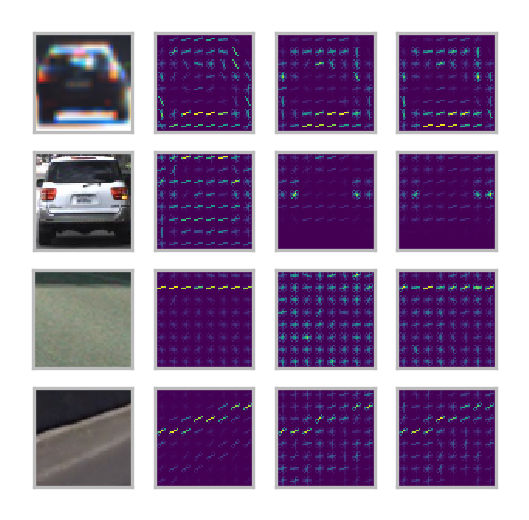
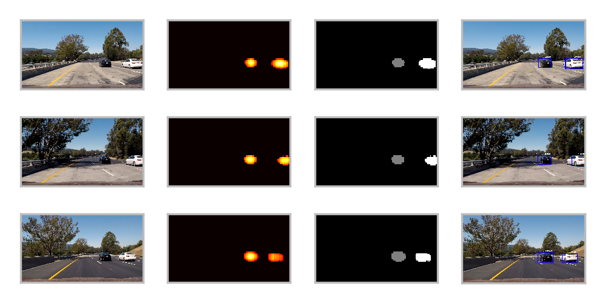
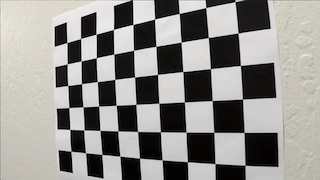
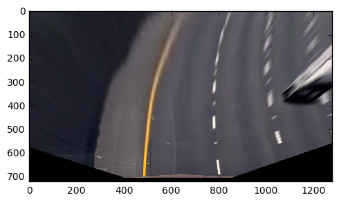
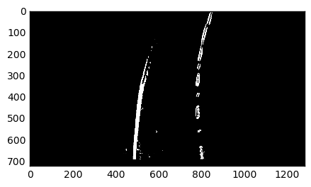
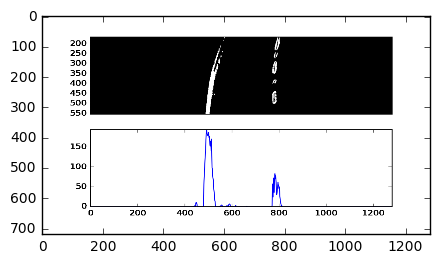
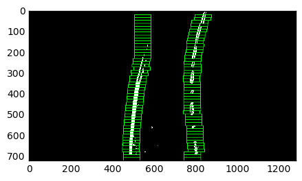
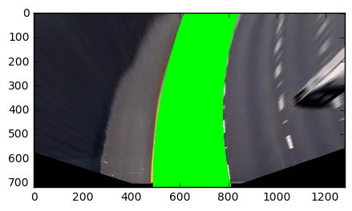

# Vehicle Detection and Lane Finding

## Final Video
The [video showing combined result of vehicle detection and lane finding](https://youtu.be/Qjrnx3H-1tc)

The following sections describe the method and techniques used to do vehicle detection and lane finding,

## Vehicle Detection
### Training Dataset:
1. [Vehicle](https://s3.amazonaws.com/udacity-sdc/Vehicle_Tracking/vehicles.zip) and [non-vehicle](https://s3.amazonaws.com/udacity-sdc/Vehicle_Tracking/non-vehicles.zip)
2. [Dataset annotated by Autti](http://bit.ly/udacity-annotations-autti)
3. [Dataset annotated by Crowd.ai](http://bit.ly/udacity-annoations-crowdai)

A total number 35k car image and 35k non car images were used in training, 20% of them were used in validation phase.

### Feature Selection
The images were transformed into YCrCb colorspace and resize to 64*64 pixel
The feature vector contains HOG and Color spatial features

1. For HOG feature extraction, the following parameters were used
	
		orient = 9
		pix_per_cell = 8
		cell_per_block = 4
		hog_channel = 'ALL'

The feature vector has a dimension of 13872

### Classification
Linear SVM Classifier provided by sklearn was used, which eventually invoke libsvm

Training accuracy:
Validation accuracy: 0.9925

### Detection

#### sliding window
Square shaped sliding window of size 96, 112, 128 pixels were used to search interested area of the video. buffer the window position for positive predictions.

#### Skip frames
To increase processing speed, only 1 in every 5 frames are processed.

#### Eliminate False Positives
To eliminate false positives, buffering and thresholding were used:
* buffering prediction result for last five frames, apply a dynamic threshold to pixels that have positive predictions, the threshold value is determined by the total number of positive windows in the buffer.

		# all_windows: sliding windows that have positive predictions
		# min_threshold: a pre-determined minimum threshold

		threshold = max(int(len(all_windows) * .15), min_threshold)

For example, if total number of positive sliding windows in the buffer are 120, then the threshold is 120 * 0.15 = 18. All pixels that have less or equal to 18 positive predictions will be seen as negative.

## Lane Finding

To mark the lane in which the vehicle is driving, following processing pipelines were implemented.

#### Camera Calibration

Using a set of chessboard images to calculate camera calibration matrix and use it to undo the distortion of video image.

#### Birds eye view
Using perspective transform to turn the image into Birds eye view, so

#### Detect lane edges

By transform the image to different color spaces and apply different threshold ranges, stacking the resulted binary images, the lane edges could be separated from background and other objects reasonably 
* R of RGB range from 153, 255 
* R of RGB range from 200, 255
* S of HLS range from 150 255
* U of YUV range from 150 171
* Use Sobel operator to detect edges in the interested area, since lane lines directions are mostly vertical in the image, so sobel operator was applied along x-axe.

Because variation of lighting, shadowing and other interference. the accuracy of different color space and threshold ranges varies. To reduce false positives, another threshold was applied to total number of positive pixels, if the threshold is exceeded the result won't be merged into final output.

#### Histogram
A histogram of non-zero pixels of calculated, two peaks of the histogram are seen as the most like position of lane line edges

#### Probing Window
apply two series of probing windows from bottom to top, to locate all the non-zero pixels in lane edge area. As the windows progressing along y-axe, its center was repeated recalculated to allow the window follows the bending or leaning lane edge.

#### Polyfit
Fit the coordinates of the non-zero pixels to a second order polynomial.
Reasoning that the fitted line won't change dramatically, the program will reject fitting result that changes too much.

